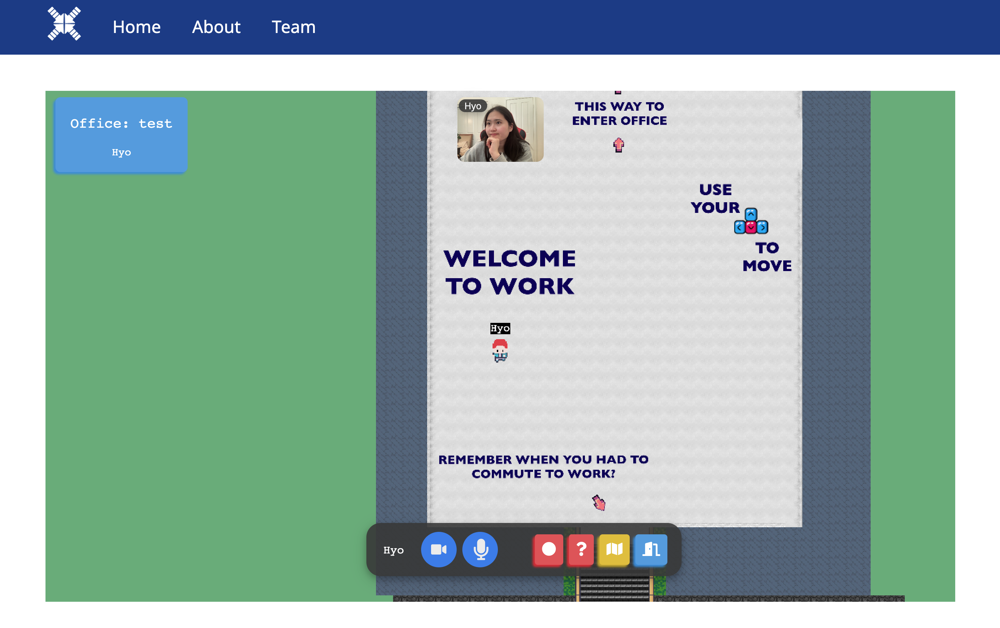

# Converge: 2D Virtual Office

2D Virtual Office with Proximity Video Chat

Fullstack Developer | ReactJS | Phaser | Socket.io | WebRTC/PeerJS | Node/Express

<br>

<div align="left">


</div>
<br>

Check out the deployed version [here](https://www.converge-app.com/).

## Description

Converge is a virtual platform that allows teams to meet and interact while working remotely. Upon joining a room, users can customize the avatar that best represents themselves and talk to their coworkers by walking up to them, just like how we interact with others in real life!

My contributions:

- Utilized WebRTC and PeerJS to identify ICE candidates, send call offers, and handle answering of peer-to-peer
  calls

- Implemented connections allowed for seamless video and audio streaming based on in-game proximity to other
  users

- Wrote Socket.io events to synchronize many user events including connecting, disconnecting, and movement,
  enabling users to see and interact with each other in real time

## Getting Started & Execute

1. Clone this repository on your local device <br>`git clone https://github.com/hik010/Converge-2dVirtualOffice.git`
2. Install dependencies: `npm install`
3. Start: `npm run start-dev` & Open localhost:8090

### How To Use

<div align="center">



</div>

1. Create or Join Room from the home page
2. Create your own avatar
3. Walk around the office + chat with other employees around you

<!-- ## Help

Any advise for common problems or issues.

```
command to run if program contains helper info
``` -->

## Authors

1. Hyo Kim
   [](https://www.linkedin.com/in/hyo-kim/)
2. Dakota Leonard
3. Kelsey Smith
4. Lydia Rees
